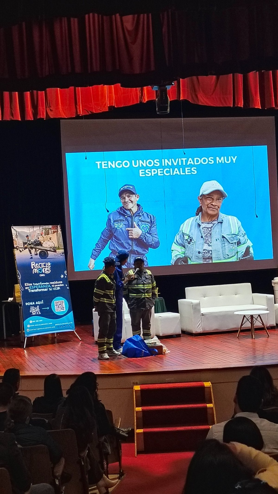
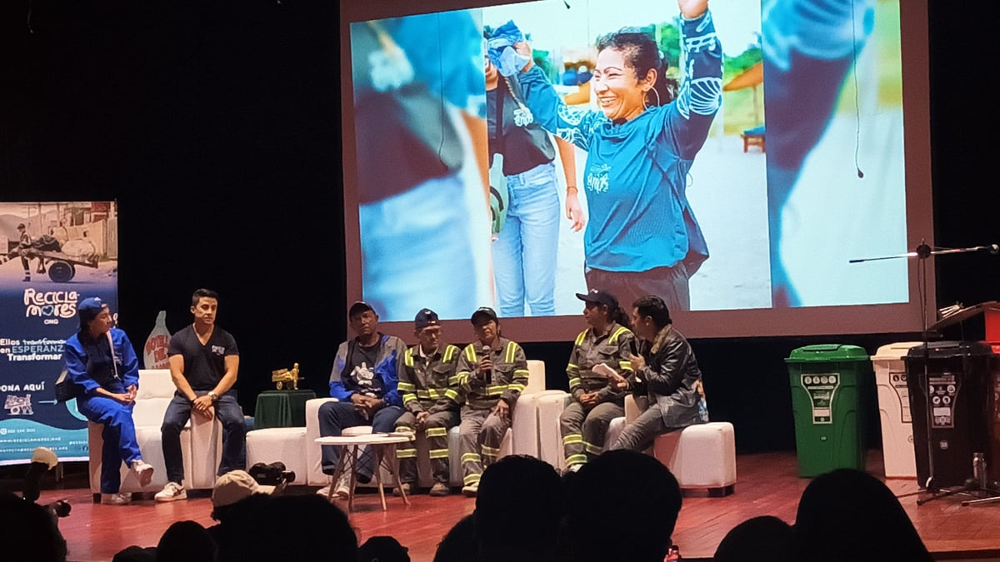
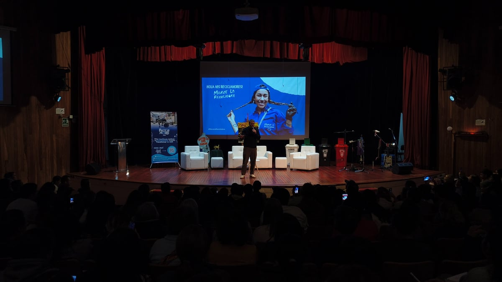

> Un relato sobre los reciclamores, los héroes invisibles que mantienen limpio el planeta y cuya labor transforma silenciosamente a Colombia.

"Lloré como seis veces."

"Nos movimos entre el humor y las lágrimas… el evento lo tuvo todo."

Esas dos frases las escuché después de la Master Class de La Marce, mi reciclamor favorita. Quienes estuvimos en el auditorio del Colegio Bethlemitas le rendimos un homenaje a los héroes del planeta. Así los llaman en la fundación [Reciclamores ONG](https://reciclamores.org/).

Los reciclamores son personas que salen todos los días a la calle, no con la capa de Superman o la máscara de Batman, sino que se cuelgan a la espalda costales llenos de residuos recicables y cubren sus manos con guantes para cuidar al planeta.

#### ¿Conocían ustedes superhéroes que pasaran tan desapercibidos?

El objetivo del evento era recaudar fondos para llevar a más reciclamores al mar, cumplir sueños a través de [ReciclaDREAMS](https://reciclamores.org/recicladreams/). Hay algo muy lindo, casi poético, con la visita de ellos a una playa. Que sus manos jueguen con las olas, que sus pies se bañen con agua salada y arena, que puedan descansar en una asoleadora. Son pequeñas recompensas a sus actos de cuidado al medio ambiente. La dedicación de reciclamores y reciclamoras representa una botella menos que llegará al mar, un pitillo que no lastimará a una tortuga.

Desde ahora, toda vez que vaya a una playa colombiana limpia agradeceré a personas como Don Edinson que evita desde Cali que llegue basura a Bahia Málaga o a Jesús María que con su carreta en Bogotá detiene kilos y kilos de desechos que no contaminaron las playas de Cartagena.

Algo que aprendí es que Colombia se destaca en América Latina, pues 17% de los residuos se reciclan. Cuando la media de la región está por debajo de dos dígitos, es gracias a los reciclamores que tenemos esa cifra. Falta mucho, claro, pero la labor de los [Reciclamores](https://reciclamores.org/sobre-nosotros/) está moviendo la aguja.

Todo comienza en casa, separando bien los residuos como hemos aprendido en cada video de [Youtube](https://www.youtube.com/@MarceLaRecicladora), reel de [Instagram](https://www.instagram.com/marcelarecicladora/) o [TikTok](https://www.tiktok.com/@marcelarecicladora) de La Marce.

### La discriminación duele

Durante la conversación con los reciclamores, Variel le preguntó a Mary:

— ¿Qué es lo más difícil de tu trabajo?

Y ella dijo algo que me apachurró el corazón, más que los plásticos arrugados que recoge a diario:

— La discriminación es lo que más duele, que no nos vean en la calle.

Esa frase cayó como una bolsa negra de varias toneladas.

En ese auditorio, diez reciclamores estaban sentados en primera fila, recibiendo aplausos, cariño, gratitud. Afuera, su trabajo sigue siendo invisible para la mayoría. Todos los que estábamos esa noche los admiramos profundamente.

Uno de ellos contó que, [en su viaje al mar](https://www.tiktok.com/@marcelarecicladora/video/7543367867085901112), cuando llegó al hotel y lo recibieron con una calle de honor, se sintió "por primera vez importante". Cuarenta años cuidando al planeta… para sentir eso por primera vez.

No puedo dejar de enfatizar en ese punto, que tanto ha recalcado La Marce. *"Conozca a su reciclamor, salúdelo y dele el reciclaje bien separado."* Así, mínimo, podemos honrar y reconocer su oficio.

Todavía podemos hacer más.

### La misión detrás del aplauso

Durante tres horas, reímos con las ocurrencias de Marce, disfrutamos de la creatividad de ella reciclando canciones y aprendimos sobre reciclaje mediante concursos de educación ambiental. Sin embargo, nunca perdía de vista a quienes estaban en la primera fila, Don Fernando, Jesús María, Richie, María, María La Negra, Emma, Don Edinson Godoy, son algunos de los nombres que puedo recordar.

Tengo el gusto de llamar amiga a Sara Samaniego, han sido más de cuatro años de amistad. En ese tiempo he visto cómo ha crecido como persona, así como su bellísimo proyecto **[Marce La Recicladora](https://www.nytimes.com/es/2024/11/11/espanol/america-latina/marce-la-recicladora-youtuber-colombia.html)**. Cuando me invitó a apoyar este evento, dije que sí sin dudarlo.

Fui muy feliz vistiendo mi chaleco de voluntario. Mi misión era dar la bienvenida a cada asistente. A cada persona que me mostraba su QR le agradecía de corazón por dedicar una noche a apoyar esta importante causa y donar con su boleta.

Ayer fue un día especial para los reciclamores. Los héroes invisibles del planeta, por fin estaban en primera fila.

### Preguntas para RE-pensar

Separar tus residuos toma unos minutos. Ignorar a quien los recoge dura toda una vida. ¿Qué pequeño gesto puedes hacer hoy para que un héroe deje de sentirse invisible?

Cada día elegimos a quién vemos y a quién ignoramos. ¿Qué pasaría si mañana decidimos verlos a ellos?

La emoción de ver al mar encontrarse con sus héroes invisibles es tan grande como la de ver las olas por primera vez. ¿Cómo podemos hacer que más encuentros de estos sucedan?
