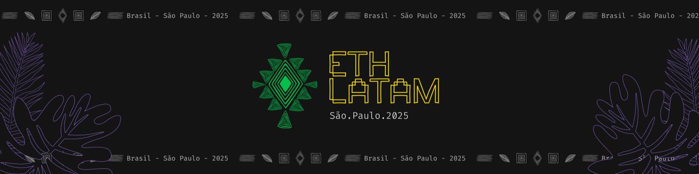

> ETH Latam llegó a su última edición y con él cerré un ciclo de cinco años construyendo comunidad en Ethereum. Entre despedidas, aprendizajes y el fin de Kipu, regreso a Colombia para reconectar raíces y preparar la próxima etapa: crear desde lo raíz.

Estuve desde el miércoles pasado hasta hoy organizando mi último evento de Ethereum. Fue una linda experiencia, [ETH Latam](https://ethlatam.org/) lo organicé por primera vez en Bogotá, después San Pedro Sula y éste en São Paulo fue el final. Cada uno dejó un aprendizaje en tres etapas.

### En este momento se cierra el círculo, lo veo como un ciclo que se completó.

El de Colombia fue la gestación de lo que se convirtió en mi fundación [ETH Kipu](https://ethkipu.org/). El año pasado en Honduras fue el punto más alto que llegamos, pues maduramos como organización y conseguimos varios hitos clave. Este año en Brasil, representó soltar una semilla en un país y convocar otras manos para que ojalá tomen la pala.

Como una planta que dio fruto dejaremos que las semillas aprovechen el suelo donde cayeron. Personalmente hace varios meses me había desprendido del proceso de cultivo en Kipu. Hasta que hace un mes el clima y otros factores externos hicieron que tuviéramos que cortar de raíz. En pocas palabras, se acabó el agua para regar la planta, no habrá más plata.

Ese cierre de ciclo, está acompañado de la tormenta emocional que implicó la ruptura con Laura. ¡Bufff, sí que ha sido duro este año! A pesar de todo, lo veo como un momento de recoger, abonar y comenzar la siembra para mi próximo septenio.

#### Hablábamos con una de mis co-fundadoras que con este evento quedó una linda estela de la estrella que implosionó.

Este fue un viaje de despedidas con amigos que hice en los últimos cinco años. Un abrazo que con algunos fue un hasta luego y con otros un adiós. En general ya no me sentía conectado con ese tipo de eventos sobre Ethereum. Cada vez los sentía más etéreos, paradójicamente.

Volver a Colombia será reconectar con las raíces que están en diferentes lugares. El proceso que estoy haciendo con el libro de historia familiar lo asumo como juntar insumos para florecer.

Reconectar con una parte de mi árbol familiar está siendo sanador. Espero entregar el 24 de diciembre a la familia Reyes.
